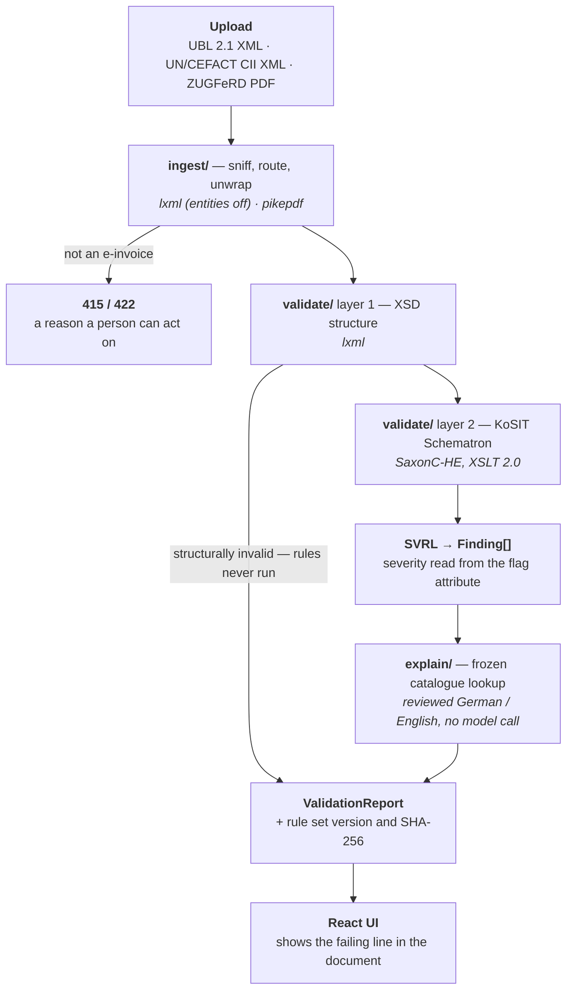

# XRechnung / ZUGFeRD validator

[](https://github.com/harshal0001/xrechnung-validator/actions/workflows/ci.yml)

Validates German e-invoices against EN 16931 and the KoSIT XRechnung rule set, and
explains each failure in plain German or English.

Validators for this already exist. What is missing is the layer between
`BR-DE-15 failed` and *"the buyer reference is missing — the federal invoice
platform routes on that field, and the ordering authority gives it to you with the
purchase order."* **That layer is the point of this project.**

**Live:** <https://cbb6tgp2x1.execute-api.eu-central-1.amazonaws.com> — three sample
invoices ship with the page, so it can be tried without having an XRechnung file.

> Validates against the published KoSIT rule set. Not a legal compliance
> certification, and does not claim to be.

---

## How it works



The invoice reaches `validate/` and stops there. **`explain/` receives a `Finding`
and nothing else** — no document, no reference to one, no way to ask for it.

---

## What makes it different

- **Grounded explanations.** Each entry splits into `what` (restates the rule, must
  trace to the official text) and `why` (context, traced to a cited public source —
  § 14 UStG, the federal e-invoicing portal, the EN 16931 model). They stay separate
  fields to the interface, so editorial text is never dressed as normative.
- **A model never sees the invoice.** Enforced by the type signature, and *tested* —
  a real invoice is validated and its IBAN, party names and line items are checked
  absent from every finding. Verified non-vacuous by injecting one.
- **Review expires.** Each entry stores the digest of the rule text it was written
  against and serves only while that matches. Reword a rule upstream and the entry
  un-reviews itself.
- **Accuracy measured in both directions.** Zero false positives is reachable by
  reporting nothing; proving rules fire is reachable by reporting everything.

---

## Measured

From real runs against the official KoSIT corpus. An empty cell is correct until
measured.

| | |
|---|---|
| False positives on 66 reference invoices | **0** — structural and business rules |
| Business rules proven to fire | **25** across 38 mutations, both syntaxes |
| Rules firing that should not | **0** |
| Explanations reviewed by a person | **62 of 62** (31 DE, 31 EN) |
| Validation latency | 27 ms/document warm |
| Startup | 2.4 s — three schemas, four stylesheets |
| Image | 218 MB, amd64 and arm64 |
| Tests | 493 backend, 21 frontend |
| Cold start | **3.6–4.7 s**, three runs — unbilled, and kept off the visitor's path |

---

## Architecture

Ports and adapters. The third column is the one that matters.

| Module | Owns | Must not |
|---|---|---|
| `core/` | `Finding`, `ValidationReport`, `Severity` | Import Saxon, lxml or the framework |
| `ingest/` | Sniffing, routing, ZUGFeRD unwrap, hardened parsing | Know anything about rules |
| `rules/` | Fetching, hashing, version-addressing KoSIT configs | Execute anything |
| `validate/` | XSD and Saxon execution; SVRL → findings | Format text for humans |
| `explain/` | Grounded explanation, review state, language | **See the invoice** |
| `api/` | Routes, uploads, error translation | Contain validation logic |

**SaxonC-HE decides the shape of everything.** KoSIT ships Schematron compiled to
XSLT 2.0 and lxml only does 1.0, so Saxon is not negotiable — and it bundles a native
library, which rules out plain serverless runtimes and makes a container the
deployment unit. It is also not thread-safe, so validation is serialised per process
and concurrency comes from more processes.

**The rule set is data, never a constant.** Downloaded, hashed, version-addressed;
every response carries the version and SHA-256 forward. XRechnung 4.0 is in flight,
and this makes that migration a configuration change.

**Severity is where naive implementations fail.** KoSIT's `fatal` flag means a
business-rule breach, not a structural failure, and valid reference invoices still
emit informational assertions. Treating every failed assertion as an error would
report **33 of 66 valid documents as broken**.

---

## Stack

| | | |
|---|---|---|
| **Validation** | SaxonC-HE, lxml, pikepdf | XSLT 2.0 is non-negotiable; lxml only does 1.0 |
| **Service** | Python 3.12, FastAPI, Pydantic v2 | Typed models, schema for free |
| **Interface** | React, TypeScript, Vite | Static build, served from the same container |
| **Package** | Docker — one image | Required: Saxon ships a native library |
| **Run** | AWS Lambda, arm64 Graviton, `eu-central-1` | Init phase unbilled — the 2.4 s compile is free |
| **Verify** | pytest, vitest, GitHub Actions | Lint, types, tests, multi-arch build on every change |

---

## Deployment

**One image, no platform branches.** It carries the Lambda Web Adapter, which the
Lambda runtime loads from `/opt/extensions` and every other host never reads — so the
same bytes run on Lambda, Cloud Run, Render or a laptop. There is no Lambda handler
and no second Dockerfile.

Frankfurt, so German invoices are processed in Germany. The frontend is served by the
same process: one origin, no CORS, one thing to deploy. An HTTP API is the front door
rather than a Function URL, and a scheduled ping keeps an execution environment warm so
the cold start is never a visitor's problem. Both have reasons worth reading:
`deploy/README.md`.

```bash
docker build -t xrv . && docker run --rm -p 8080:8080 xrv
```

---

## Not in scope

Invoice generation · Peppol transmission (Germany mandates the format, not the
channel) · ERP connectors · PDF/A-3 conformance checking (veraPDF's job) · **any
claim of legal compliance certification**.

---

## Licence and references

© 2026 Harshal Kothari. All rights reserved. Published for review as a portfolio
project; not licensed for reuse or redistribution.

Rule sources: [KoSIT validator configuration](https://github.com/itplr-kosit/validator-configuration-xrechnung) ·
[EN 16931 Schematron](https://github.com/ConnectingEurope/eInvoicing-EN16931) ·
[German CIUS Schematron](https://github.com/itplr-kosit/xrechnung-schematron).
Sample invoices derive from the [KoSIT test suite](https://github.com/itplr-kosit/xrechnung-testsuite)
(Apache-2.0); see `frontend/public/samples/NOTICE.md`.
